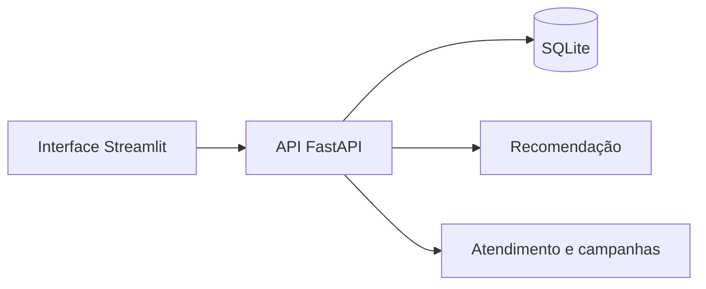

# BeautyFlow

Plataforma de gestão para salões, clínicas de estética e profissionais autônomos. O projeto centraliza agenda, clientes, serviços, campanhas e apoio ao atendimento em uma única aplicação.

## Visão do produto

Negócios de beleza costumam distribuir informações entre agenda, mensagens, planilhas e anotações. O BeautyFlow reúne esses dados e transforma tarefas do dia a dia em fluxos organizados.

## Funcionalidades

- dashboard com clientes, agenda, receita e ticket médio;
- cadastro e manutenção de clientes e serviços;
- agenda com criação de horários e atualização de status;
- recomendação de serviços conforme o perfil da cliente;
- apoio à criação de mensagens e campanhas;
- simulação de atendimento e agendamento por WhatsApp;
- API documentada automaticamente;
- testes dos principais fluxos da aplicação.

## Arquitetura


```mermaid
flowchart LR
    UI[Interface Streamlit] --> API[API FastAPI]
    API --> DB[(SQLite)]
    API --> REC[Recomendação]
    API --> MSG[Atendimento e campanhas]
```

## Tecnologias

`Python` `FastAPI` `Streamlit` `SQLModel` `SQLite` `Pandas` `Pytest` `HTTPX`

## Executar localmente

```bash
python -m venv .venv
```

No Windows:

```bash
.venv\Scripts\activate
```

No Linux ou macOS:

```bash
source .venv/bin/activate
```

Instale as dependências e prepare os dados:

```bash
pip install -r requirements.txt
python seed.py
```

Inicie a API:

```bash
python -m uvicorn app.main:app --reload
```

Em outro terminal, inicie a interface:

```bash
python -m streamlit run frontend/streamlit_app.py
```

- Aplicação: `http://localhost:8501`
- Documentação da API: `http://127.0.0.1:8000/docs`

## Estrutura

```text
app/             API, banco, serviços e recomendação
frontend/        interface e páginas da aplicação
data/            dados demonstrativos
knowledge_base/  conteúdo de apoio
docs/            documentação do produto
tests/           testes automatizados
```

## Testes

```bash
python -m compileall app frontend tests seed.py
pytest -q
```

Os testes usam um banco SQLite isolado e cobrem saúde da API, criação de
agendamentos, simulação de atendimento e campanhas.
## Status

Protótipo funcional para apresentação e execução local. Integrações externas, autenticação por usuário e infraestrutura em nuvem fazem parte da evolução planejada.

## Autoria

[Geovanna Eduarda da Silva](https://github.com/geovannasilva15)
